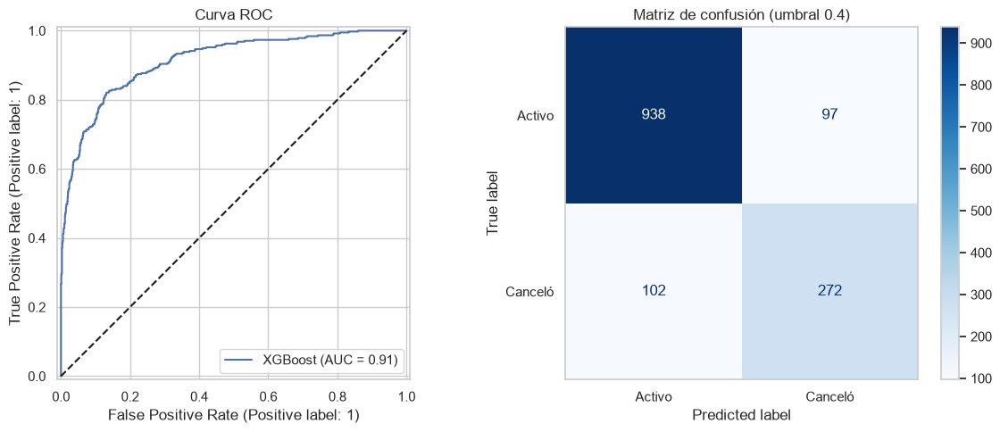
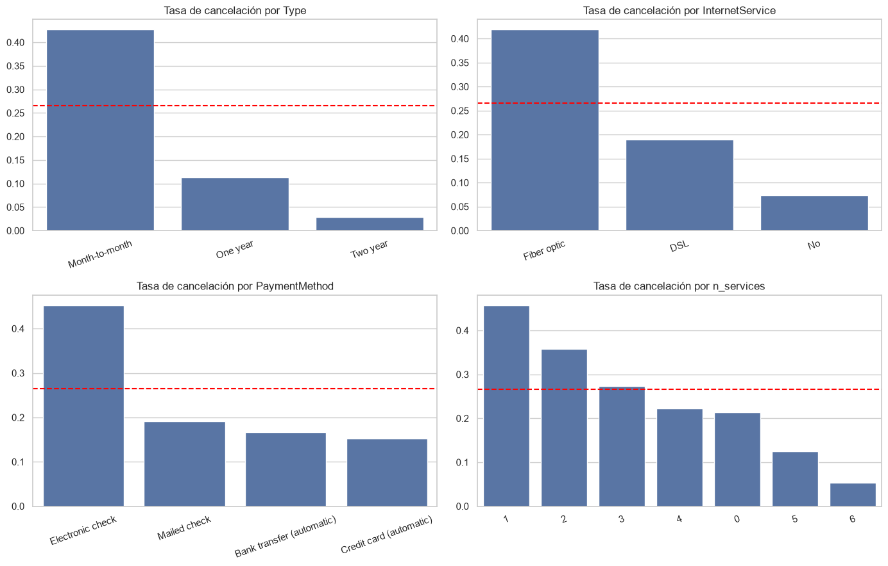

**English** | [Español](README.es.md)

# Telecom - Customer Churn Prediction

Machine Learning project to predict which customers of a telecom company are going to cancel their contract (churn), so the company can offer them promotions before they leave.

## Results

The best model was **XGBoost** (tuned with GridSearch, with a decision threshold of 0.4). These are its results on the test set:

| Metric | Value |
|---|---|
| ROC-AUC | 0.91 |
| F1 | 0.73 |
| Recall | 0.73 |
| Precision | 0.74 |

The model finds 3 out of 4 customers who cancel.



## Key findings

- Customers with a **month-to-month contract** cancel much more (over 40%) than those with one or two-year contracts.
- Customers with **fiber optic** internet and those who pay by **electronic check** also cancel more than average (26.5%).
- Customers who cancel have been with the company for less time and pay more per month.



## Data

Four files in `data/raw/` joined by `customerID` (7,043 customers):

- `contract.csv`: contract dates, contract type, payment method and charges.
- `personal.csv`: gender, senior citizen, partner and dependents.
- `internet.csv`: internet type and add-on services (security, backup, support, streaming).
- `phone.csv`: whether the customer has multiple lines.

## What I did

1. Cleaned and merged the tables, and created new features like months as a customer and number of services.
2. Did an exploratory analysis to see which customers cancel more.
3. Compared Logistic Regression, Random Forest and XGBoost with cross-validation (with and without SMOTE) against a baseline model.
4. Tuned XGBoost with GridSearch and chose the decision threshold.
5. Evaluated the final model only once on the test set.

**Something I fixed:** in the first version I used the wrong cutoff date (2021-02-01 instead of 2020-02-01) to calculate how long each customer had been active. This made the model look much better than it really was (F1 of 0.87). After fixing it, the metrics went down, but now they are real.

## Project structure

```
telecom/
├── data/raw/                  # original data
├── notebooks/
│   └── telecom_churn.ipynb    # full analysis and modeling
├── results/figures/           # charts
└── requirements.txt
```

## How to run it

```bash
git clone https://github.com/dixonpa/telecom.git
cd telecom
python -m venv .venv
.venv\Scripts\activate        # on Windows
source .venv/bin/activate     # on Mac/Linux
pip install -r requirements.txt
jupyter notebook notebooks/telecom_churn.ipynb
```

The notebook and charts are in Spanish.

## Tools

Python, pandas, scikit-learn, XGBoost, imbalanced-learn, matplotlib, seaborn.

## Author

Paulo Alvarez · [LinkedIn](https://www.linkedin.com/in/paulocealva) · [Portfolio](https://dixonpa.github.io/) · palvareza17@gmail.com
